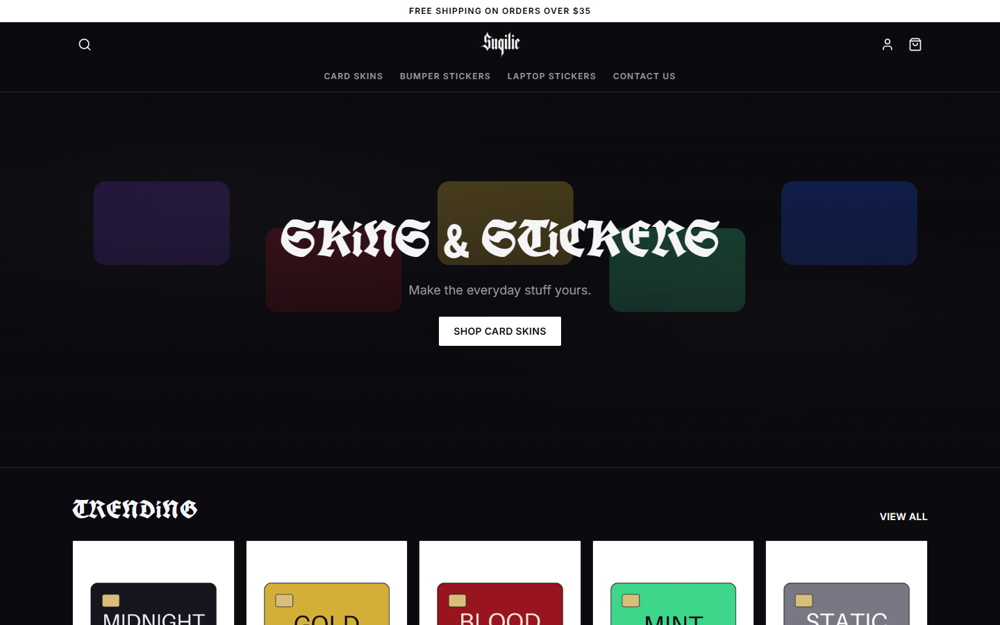
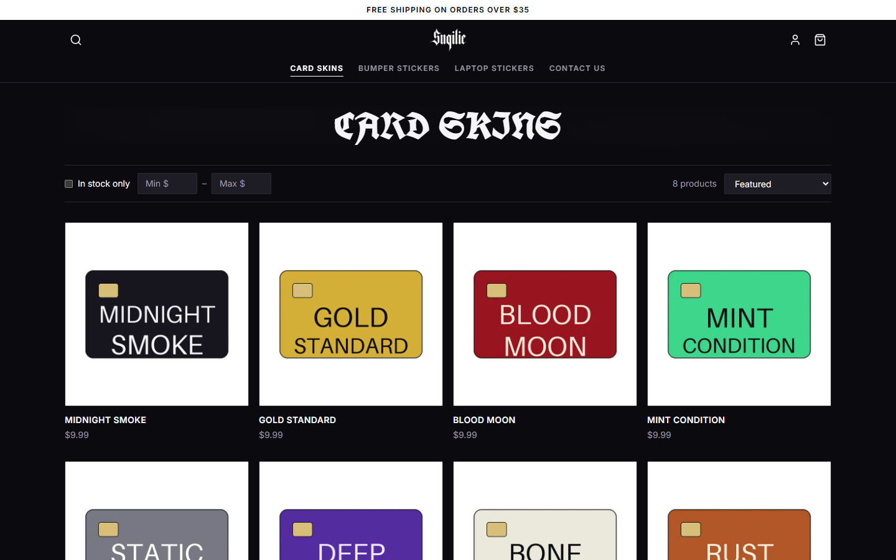
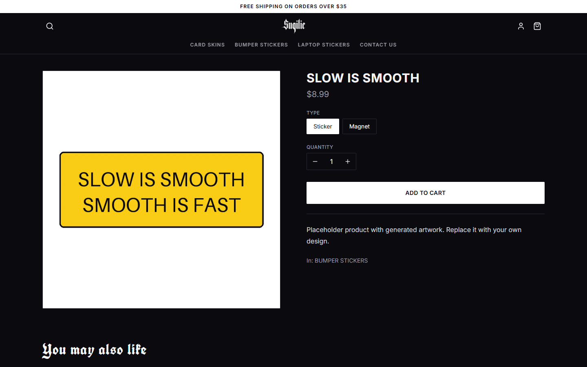
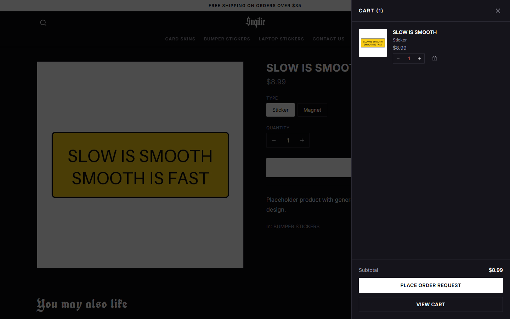
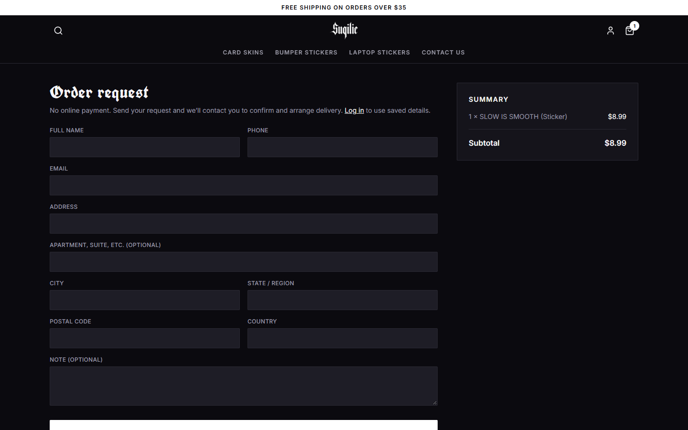
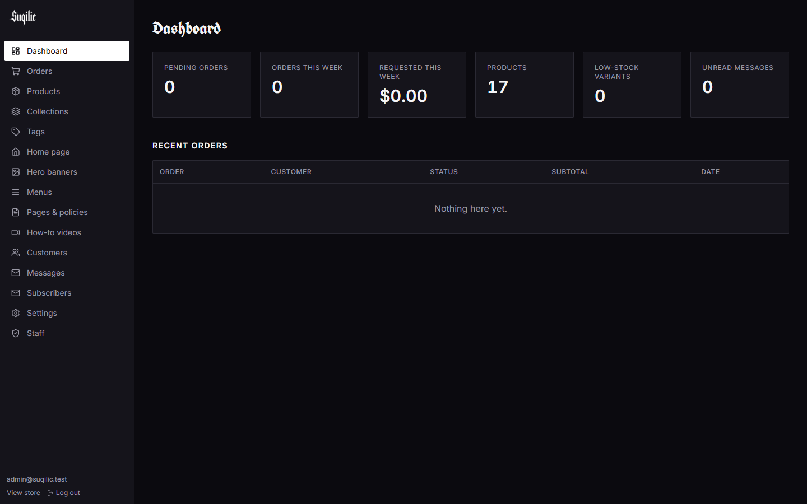
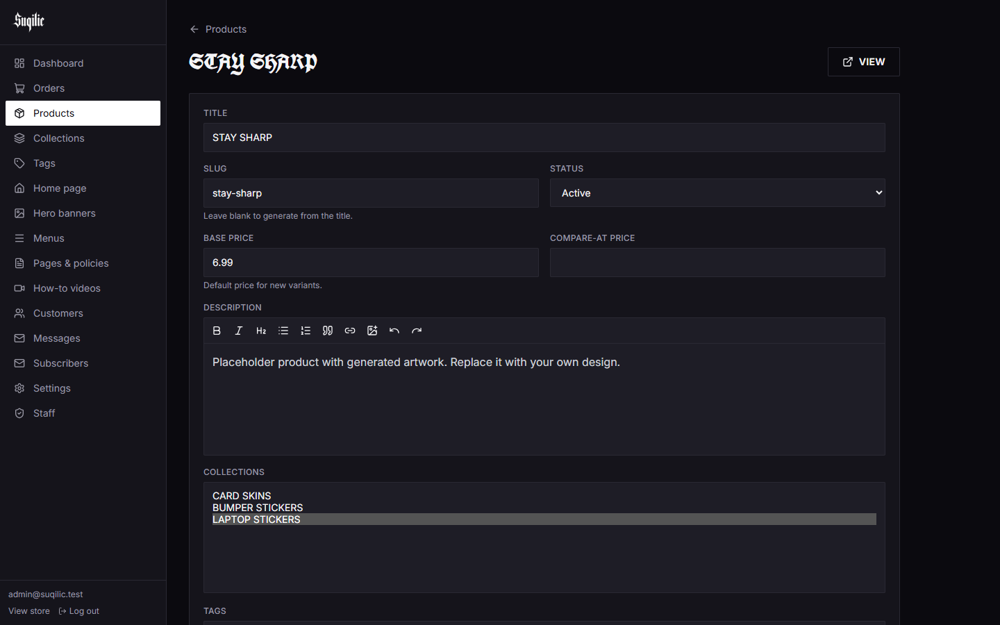
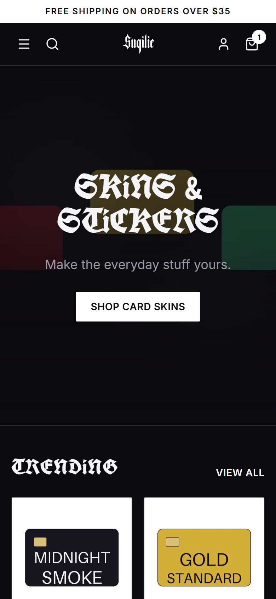
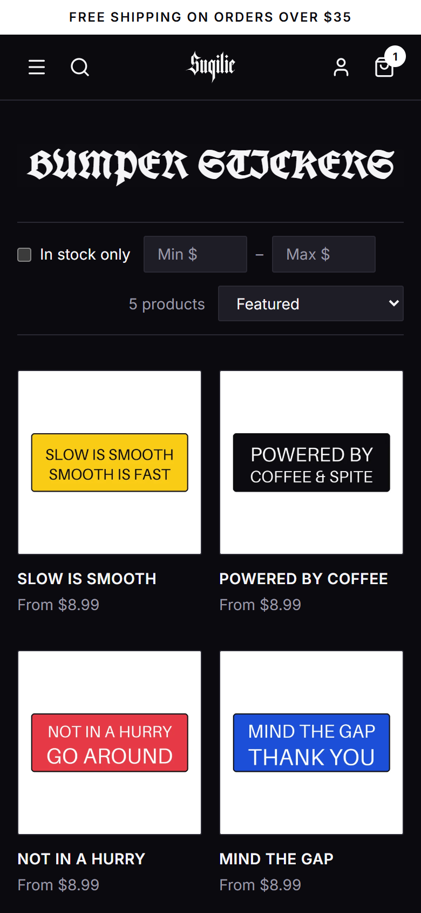

<div align="center">


# Suqilic

**A full-stack storefront for card skins and stickers: Django REST API, React storefront, and a custom admin dashboard.**

[**Live demo → suqilic.onrender.com**](https://suqilic.onrender.com)

[](https://github.com/AsadShibli/suqilic/actions/workflows/ci.yml)

<sub>The demo runs on a free tier. A scheduled job keeps it warm, and if it does sleep the store says so instead of showing blank boxes.</sub>



</div>

## What it is

Suqilic is an online store for a small Bangladeshi shop. Customers browse the catalog, fill a cart, and either **pay online through SSLCommerz** (bKash, Nagad, cards) or choose **cash on delivery**. Behind the storefront is a small inventory system: suppliers, purchase orders, and a stock ledger that records every unit in and out.

- a fast, dark storefront styled after the brand's blackletter logo
- a staff dashboard at a separate URL to manage products, orders, stock, purchasing, and all site content
- a documented REST API behind both, with Celery background jobs and a versioned response cache

## Screenshots

| Collection with sorting and filters | Product page with variants |
|---|---|
|  |  |

| Cart drawer | Order request (no payment) |
|---|---|
|  |  |

| Admin dashboard | Admin product editor |
|---|---|
|  |  |

<p align="center">
  
  &nbsp;&nbsp;
  
</p>

<sub>Screenshots use the built-in placeholder catalog (`seed_placeholder_catalog`), whose artwork is generated by the project.</sub>

## Features

**Storefront**
- Home page built from admin-managed sections: hero banners and product carousels
- Collections with sorting (featured, best selling, price, A–Z, newest), price and stock filters, and "load more"
- Product pages with image gallery, option-based variants (e.g. Sticker / Magnet), and related products
- Instant search suggestions plus a full results page
- Cart for guests and signed-in customers; a guest cart merges into the account on login
- Order request checkout, order confirmation emails, and order tracking by number + email
- Customer accounts: register, login, password reset, order history
- Contact form, how-to videos, policy pages, newsletter signup
- Responsive from 375px up, keyboard-accessible menus and drawers

**Admin dashboard** (staff only, at a configurable path)
- Dashboard with pending orders, weekly totals, low stock, and unread messages
- Products: rich-text description, multiple images (auto-converted to WebP with thumbnails), options and variant generation, per-variant price and stock, duplicate, bulk actions
- Collections with manual product ordering
- Orders: search and filter, status changes with history and optional customer email, internal notes, CSV export, print view
- Home sections, hero banners, navigation menus, pages and policies, videos
- Customers, contact messages, newsletter subscribers (CSV export), site settings, staff accounts

**Online payments (SSLCommerz sandbox)**
- Hosted checkout session per attempt; customers can retry a failed or cancelled payment
- The browser return and the server-to-server IPN both confirm the payment with SSLCommerz's validation API; callback POST data alone is never trusted
- Repeat-safe settlement: the payment row is locked with `SELECT … FOR UPDATE`, an already-paid payment is left untouched, and a unique `val_id` stops one gateway validation from settling two payments
- Rejects amount or currency mismatches; the order history records the transaction

**Inventory (mini-ERP)**
- Every stock change goes through one service and writes an append-only `StockMovement` row (sale, cancellation, purchase receipt, manual adjustment) with the balance after
- Suppliers and purchase orders: draft → ordered → partially received → received, with partial deliveries and over-receipt protection
- Editing stock on the product page is recorded as an adjustment, so the ledger always adds up to current stock
- Ledger screen with filters, CSV export, and manual adjustments that need a reason

**API and backend**
- Versioned REST API (`/api/v1`) with JWT auth, pagination, filtering, and throttling on sensitive endpoints
- Stock is locked and decremented when an order is placed, and restored if the order is cancelled
- Order items snapshot title, variant, and price, so later product edits never change past orders
- Celery + Redis for emails and image thumbnails; with no Redis configured, tasks fall back to a background thread so the free tier still works
- Versioned cache on public catalog endpoints (`X-Cache: HIT/MISS`): any catalog write bumps one version key instead of tracking which URLs changed
- Pluggable media storage: local disk, or Postgres-backed for hosts without a persistent disk
- 43 backend tests covering catalog queries, the cart-to-order flow, payments and replayed callbacks, purchasing and the stock ledger, permissions, and storage
- GitHub Actions CI: ruff, migration check, Django deploy checks, and the test suite on Postgres, plus frontend lint, type-check and build

## Tech stack

| Layer | Tools |
|---|---|
| Backend | Python 3.11, Django 5.1, Django REST Framework, SimpleJWT, django-filter, drf-spectacular, Pillow, Celery |
| Frontend | React 19, TypeScript, Vite, Tailwind CSS 4, TanStack Query, Zustand, React Hook Form + Zod, Embla, TipTap |
| Data | PostgreSQL in production (SQLite locally), Redis for the Celery broker and cache |
| Payments | SSLCommerz hosted checkout (sandbox) |
| CI | GitHub Actions: tests on Postgres, ruff, oxlint, type-check |
| Deploy | Render Blueprint (`render.yaml`), or Docker Compose with nginx + gunicorn |

## Project structure

```
backend/
  apps/
    accounts/     custom user (email login), addresses, auth + /me endpoints
    catalog/      products, variants, options, images, collections, tags
    storefront/   home sections and hero banners
    orders/       cart, orders, status history
    inventory/    suppliers, purchase orders, stock movement ledger
    payments/     SSLCommerz checkout, callback validation, repeat-safe settlement
    core/         settings, menus, pages, videos, contact, newsletter, shared utilities
  config/         settings (base / dev / prod), URLs
  tests/          pytest suite
frontend/
  src/
    pages/        storefront routes
    admin/        staff dashboard (lazy-loaded, separate bundle)
    api/          React Query hooks
    components/   layout, product, cart, shared UI
docs/             API reference, ERD, plan, screenshots
```

More detail: [API reference](docs/API.md) · [database diagram](docs/erd.png) · [requirements](REQUIREMENTS.md)

## Run it locally

Requires Python 3.11+ and Node 20+.

```bash
# 1. Backend → http://127.0.0.1:8000
cd backend
python -m venv .venv
.venv/Scripts/pip install -r requirements-dev.txt      # macOS/Linux: .venv/bin/pip
cp .env.example .env                                   # then set SECRET_KEY
.venv/Scripts/python manage.py migrate
.venv/Scripts/python manage.py createsuperuser
.venv/Scripts/python manage.py seed_placeholder_catalog   # demo products with generated artwork
.venv/Scripts/python manage.py runserver
```

```bash
# 2. Frontend → http://localhost:5173 (proxies /api and /media to Django)
cd frontend
cp .env.example .env.local
npm install
npm run dev
```

| | URL |
|---|---|
| Store | http://localhost:5173 |
| Admin dashboard | http://localhost:5173/suqilic-control (staff accounts only) |
| API docs (dev only) | http://127.0.0.1:8000/api/docs/ |

The admin path comes from `VITE_ADMIN_PATH` (frontend) and `ADMIN_URL_PATH` (backend); keep them in sync and change them for a real deployment.

### Tests

```bash
cd backend && .venv/Scripts/python -m pytest && .venv/Scripts/ruff check .
cd frontend && npm run lint && npm run build        # lint, type-check, production build
```

## Deploy

### Render (free tier)

[`render.yaml`](render.yaml) provisions Postgres, the API, and the static storefront.

1. Render Dashboard → **New → Blueprint** → select this repository.
2. Enter `DJANGO_SUPERUSER_EMAIL` and `DJANGO_SUPERUSER_PASSWORD` when prompted; they become the first admin account.
3. If your service names differ from `suqilic` / `suqilic-api`, update `FRONTEND_HOST` and `VITE_API_HOST` in `render.yaml` to the public hosts.

Notes for the free tier: [`keep-warm.yml`](.github/workflows/keep-warm.yml) pings `/healthz` every 10 minutes so visitors rarely hit a cold start (an external uptime monitor on the same URL is a sturdier option). Media is stored in Postgres (`MEDIA_STORAGE=db`) because free web services have no persistent disk; the API sleeps after about 15 minutes idle; free Postgres expires after 30 days unless upgraded. The blueprint sets `NOINDEX=true`, which keeps the deployment out of search engines; remove it when you launch for real.

### Docker Compose

```bash
# backend/.env needs SECRET_KEY, ALLOWED_HOSTS, CSRF_TRUSTED_ORIGINS, FRONTEND_URL and email settings
POSTGRES_PASSWORD=... docker compose up -d --build
docker compose exec backend python manage.py createsuperuser
```

Compose also starts Redis and a Celery worker (`celery -A config worker`). nginx serves the storefront and `/media`, and proxies `/api`, `/django-admin`, `/sitemap.xml` and `/robots.txt` to gunicorn.

## Configuration

| Variable | Where | Purpose |
|---|---|---|
| `SECRET_KEY`, `ALLOWED_HOSTS`, `DATABASE_URL` | backend | Standard Django settings |
| `FRONTEND_URL` / `FRONTEND_HOST` | backend | Storefront origin for CORS, emails, and the sitemap |
| `ADMIN_URL_PATH`, `DJANGO_ADMIN_PATH` | backend | Paths of the staff dashboard and the fallback Django admin |
| `MEDIA_STORAGE` | backend | `filesystem` (default) or `db` |
| `NOINDEX` | backend | `true` blocks search engine indexing (staging) |
| `EMAIL_*`, `STORE_ADMIN_EMAIL` | backend | SMTP settings; emails print to the console by default |
| `REDIS_URL` | backend | Celery broker + shared cache. Empty: tasks run in a background thread, cache is per process |
| `SSLCOMMERZ_STORE_ID`, `SSLCOMMERZ_STORE_PASSWORD`, `SSLCOMMERZ_SANDBOX` | backend | Online payments ([free sandbox account](https://developer.sslcommerz.com/registration/)). Empty: cash on delivery only |
| `VITE_API_URL` / `VITE_API_HOST` | frontend | API location when it is not same-origin |
| `VITE_ADMIN_PATH` | frontend | Must match `ADMIN_URL_PATH` |

## Notes

- The live demo's catalog is sample content used for staging only. It is not for sale, and its product imagery belongs to its respective owners.
- This is a portfolio / learning project. Before using it for a real shop, add your own products, configure SMTP, and review the security settings in `backend/config/settings/prod.py`.
